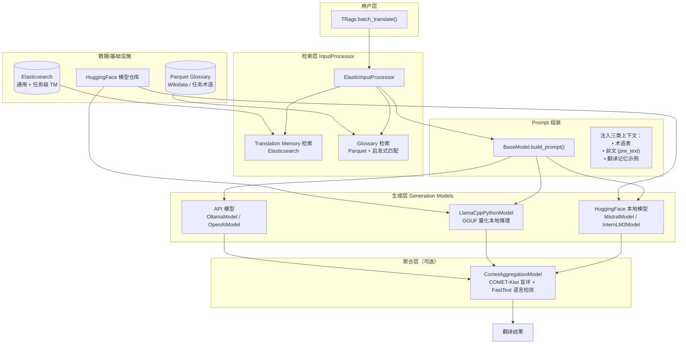
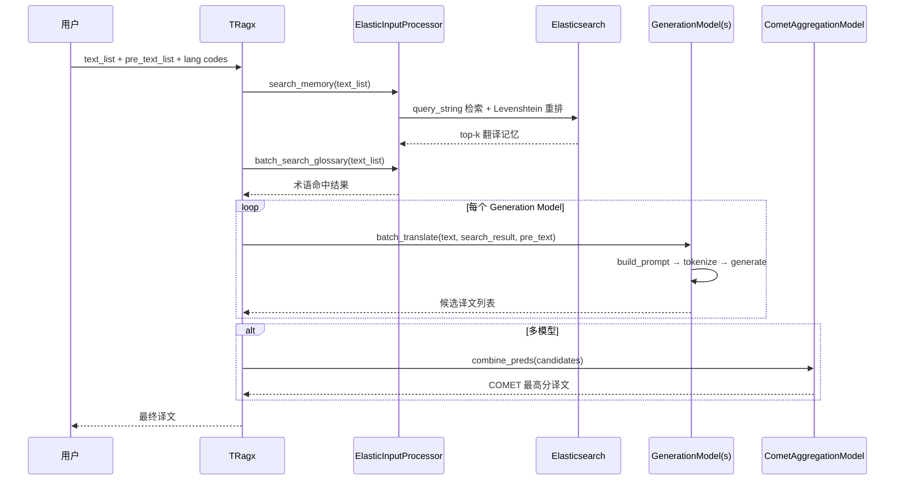
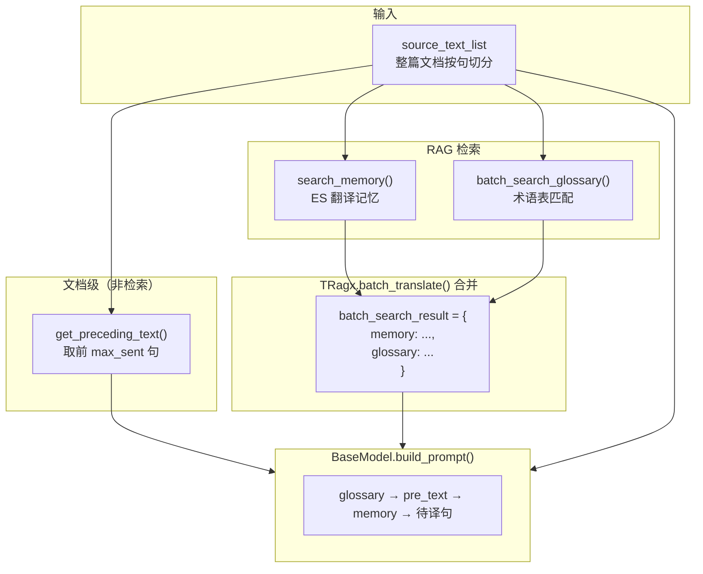

```mermaid
flowchart TB
    subgraph User["用户层"]
        API["TRagx.batch_translate()"]
    end

    subgraph RAG["检索层 InputProcessor"]
        EIP["ElasticInputProcessor"]
        BM["Translation Memory 检索<br/>Elasticsearch"]
        BG["Glossary 检索<br/>Parquet + 启发式匹配"]
        EIP --> BM
        EIP --> BG
    end

    subgraph Prompt["Prompt 组装"]
        BP["BaseModel.build_prompt()"]
        CTX["注入三类上下文：<br/>• 术语表<br/>• 前文 (pre_text)<br/>• 翻译记忆示例"]
    end

    subgraph Gen["生成层 Generation Models"]
        HF["HuggingFace 本地模型<br/>MistralModel / InternLM2Model"]
        GGUF["LlamaCppPythonModel<br/>GGUF 量化本地推理"]
        API_M["API 模型<br/>OllamaModel / OpenAIModel"]
    end

    subgraph Agg["聚合层（可选）"]
        COMET["CometAggregationModel<br/>COMET-Kiwi 盲评 + FastText 语言检测"]
    end

    subgraph Data["数据/基础设施"]
        ES[("Elasticsearch<br/>通用 + 任务级 TM")]
        GLOSS[("Parquet Glossary<br/>Wikidata / 任务术语")]
        HFHub["HuggingFace 模型仓库"]
    end

    API --> EIP
    EIP --> BP
    BP --> HF
    BP --> GGUF
    BP --> API_M
    HF --> COMET
    GGUF --> COMET
    API_M --> COMET
    COMET --> OUT["翻译结果"]

    ES --> BM
    GLOSS --> BG
    HFHub --> HF
    HFHub --> GGUF
```

dataflow:

```mermaid
sequenceDiagram
    participant U as 用户
    participant T as TRagx
    participant P as ElasticInputProcessor
    participant ES as Elasticsearch
    participant M as GenerationModel(s)
    participant A as CometAggregationModel

    U->>T: text_list + pre_text_list + lang codes
    T->>P: search_memory(text_list)
    P->>ES: query_string 检索 + Levenshtein 重排
    ES-->>P: top-k 翻译记忆
    T->>P: batch_search_glossary(text_list)
    P-->>T: 术语命中结果
    loop 每个 Generation Model
        T->>M: batch_translate(text, search_result, pre_text)
        M->>M: build_prompt → tokenize → generate
        M-->>T: 候选译文列表
    end
    alt 多模型
        T->>A: combine_preds(candidates)
        A-->>T: COMET 最高分译文
    end
    T-->>U: 最终译文
```

从原始文本到prompt的过程：

```mermaid
flowchart TB
    subgraph Input["输入"]
        DOC["source_text_list<br/>整篇文档按句切分"]
    end

    subgraph DocCtx["文档级（非检索）"]
        PT["get_preceding_text()<br/>取前 max_sent 句"]
    end

    subgraph RAG["RAG 检索"]
        MEM["search_memory()<br/>ES 翻译记忆"]
        GLO["batch_search_glossary()<br/>术语表匹配"]
    end

    subgraph Merge["TRagx.batch_translate() 合并"]
        SR["batch_search_result = {<br/>  memory: ...,<br/>  glossary: ...<br/>}"]
    end

    subgraph Prompt["BaseModel.build_prompt()"]
        P["glossary → pre_text → memory → 待译句"]
    end

    DOC --> PT
    DOC --> MEM
    DOC --> GLO
    PT --> Prompt
    MEM --> SR
    GLO --> SR
    SR --> Prompt
    DOC --> Prompt
```
